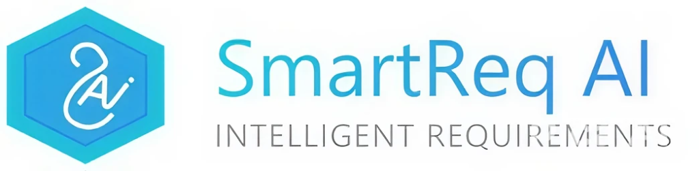
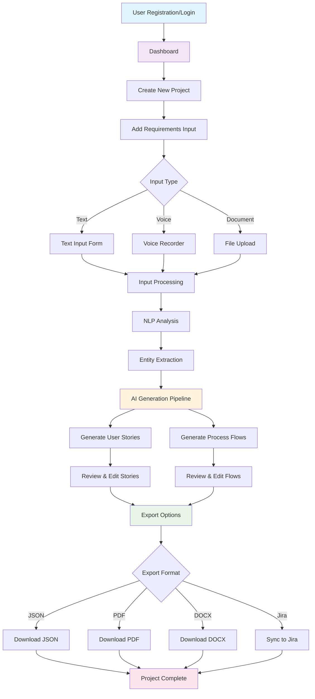

<div align="center">

# SmartReq AI

### AI-Powered Requirement Gathering Platform



**Transforming requirements into smart, automated insights for faster and seamless project success.**

[](https://opensource.org/licenses/MIT)
[](https://nodejs.org/)
[](https://nextjs.org/)
[](https://reactjs.org/)
[](https://www.typescriptlang.org/)

[Live Demo](#) | [Documentation](#) | [Report Bug](#) | [Request Feature](#)

</div>

---

## Table of Contents

- [Overview](#overview)
- [Problem Statement](#problem-statement)
- [Solution Architecture](#solution-architecture)
- [Key Features](#key-features)
- [Technology Stack](#technology-stack)
- [System Architecture](#system-architecture)
- [Getting Started](#getting-started)
- [Usage Guide](#usage-guide)
- [API Documentation](#api-documentation)
- [AI/NLP Processing](#ainlp-processing)
- [Security](#security)
- [Deployment](#deployment)
- [Contributing](#contributing)
- [Team](#team)
- [License](#license)

---

## Overview

**SmartReq AI** is an AI-powered platform that automates the requirement gathering process, transforming stakeholder inputs into structured user stories and process flows. Built for modern development teams, SmartReq AI leverages Natural Language Processing (NLP) and Large Language Models (LLMs) to help business analysts, project managers, and development teams capture, analyze, and document project requirements efficiently.

### Why SmartReq AI?

Traditional requirement gathering faces critical challenges:
- **Time-Intensive**: Weeks of meetings and documentation
- **Error-Prone**: Miscommunication leads to costly rework
- **Inconsistent**: Varying documentation standards
- **Limited Scalability**: Manual processes don't scale
- **Stakeholder Friction**: Difficulty articulating technical needs

SmartReq AI solves these challenges by automating the requirement gathering lifecycle while maintaining human oversight and control.

---

## Problem Statement

### Domain: Fintech/AI and Automation

**Challenge**: Traditional requirement gathering in software development is:
- **Time-Consuming**: Manual documentation takes weeks
- **Error-Prone**: Human interpretation leads to miscommunication
- **Resource-Intensive**: Requires significant analyst effort
- **Inconsistent**: Lack of standardized formats
- **Difficult to Scale**: Cannot handle multiple projects simultaneously

**Impact**: These challenges result in:
- Delayed project timelines
- Budget overruns
- Scope creep and rework
- Stakeholder dissatisfaction
- Reduced team productivity

### The SmartReq AI Solution

SmartReq AI addresses these challenges through:
1. **Automated Processing**: AI-driven analysis of stakeholder inputs
2. **Multi-Modal Input**: Support for text, voice, and documents
3. **Instant Generation**: Real-time creation of user stories and flows
4. **Interactive Visualization**: Dynamic, editable process diagrams
5. **Seamless Integration**: Connect with existing project management tools

---

## Solution Architecture

### High-Level Architecture

```
┌─────────────────────────────────────────────────────────────────┐
│                        Client Layer                             │
│  ┌──────────────┐  ┌──────────────┐  ┌──────────────┐         │
│  │   Web UI     │  │  Mobile App  │  │   Desktop    │         │
│  │  (Next.js)   │  │   (Future)   │  │   (Future)   │         │
│  └──────────────┘  └──────────────┘  └──────────────┘         │
└─────────────────────────────────────────────────────────────────┘
                              │
                              ▼
┌─────────────────────────────────────────────────────────────────┐
│                      API Gateway Layer                          │
│  ┌──────────────────────────────────────────────────────────┐  │
│  │           Express.js REST API + Socket.IO                │  │
│  │  • Authentication  • Rate Limiting  • Request Validation │  │
│  └──────────────────────────────────────────────────────────┘  │
└─────────────────────────────────────────────────────────────────┘
                              │
                              ▼
┌─────────────────────────────────────────────────────────────────┐
│                     Application Layer                           │
│  ┌──────────────┐  ┌──────────────┐  ┌──────────────┐         │
│  │   Projects   │  │    Inputs    │  │  Artifacts   │         │
│  │  Controller  │  │  Controller  │  │  Controller  │         │
│  └──────────────┘  └──────────────┘  └──────────────┘         │
│  ┌──────────────┐  ┌──────────────┐  ┌──────────────┐         │
│  │  Generation  │  │     Chat     │  │     Auth     │         │
│  │  Controller  │  │  Controller  │  │  Controller  │         │
│  └──────────────┘  └──────────────┘  └──────────────┘         │
└─────────────────────────────────────────────────────────────────┘
                              │
                              ▼
┌─────────────────────────────────────────────────────────────────┐
│                    AI/NLP Processing Layer                      │
│  ┌──────────────┐  ┌──────────────┐  ┌──────────────┐         │
│  │   spaCy NLP  │  │  OpenAI GPT  │  │Google Gemini │         │
│  │  Processing  │  │   (GPT-4)    │  │     API      │         │
│  └──────────────┘  └──────────────┘  └──────────────┘         │
│  ┌──────────────┐  ┌──────────────┐  ┌──────────────┐         │
│  │  OCR Engine  │  │Speech-to-Text│  │Text Analysis │         │
│  │  (Tesseract) │  │  (Web API)   │  │   (Custom)   │         │
│  └──────────────┘  └──────────────┘  └──────────────┘         │
└─────────────────────────────────────────────────────────────────┘
                              │
                              ▼
┌─────────────────────────────────────────────────────────────────┐
│                       Data Layer                                │
│  ┌──────────────┐  ┌──────────────┐  ┌──────────────┐         │
│  │  PostgreSQL  │  │  File Storage│  │    Redis     │         │
│  │  (Supabase)  │  │    (Local)   │  │   (Cache)    │         │
│  └──────────────┘  └──────────────┘  └──────────────┘         │
└─────────────────────────────────────────────────────────────────┘
```

### Component Interaction Flow

```
User Input → Input Processing → AI Analysis → Artifact Generation →
Review & Edit → Export/Integration → Project Management Tools
```

### SmartReq AI Workflow Diagram



---

## Key Features

### 1. Multi-Modal Input Processing

#### Text Input
- **Direct Entry**: Rich text editor for requirement descriptions
- **Smart Parsing**: Automatic extraction of key entities and actions
- **Context Awareness**: Understanding of domain-specific terminology
- **Real-time Validation**: Instant feedback on input quality

#### Voice Input
- **Real-time Transcription**: Web Speech API integration
- **Multi-language Support**: English, Spanish, French, German (planned)
- **Speaker Identification**: Track multiple stakeholder inputs
- **Noise Cancellation**: Advanced audio processing

#### Document Upload
- **Format Support**: PDF, DOCX, TXT, CSV, XLSX
- **OCR Processing**: Extract text from scanned documents
- **Smart Extraction**: Identify requirements from unstructured text
- **Batch Processing**: Handle multiple documents simultaneously

### 2. AI-Powered Artifact Generation

#### User Stories
- **Gherkin Format**: Industry-standard Given-When-Then structure
- **Acceptance Criteria**: Automatically generated test conditions
- **Story Points**: AI-estimated complexity scoring
- **Priority Classification**: Automatic categorization (High/Medium/Low)
- **Dependencies**: Identification of related stories

Example Generated User Story:
```gherkin
Feature: User Authentication
  As a registered user
  I want to log in to the system
  So that I can access my personalized dashboard

Scenario: Successful Login
  Given I am on the login page
  And I have valid credentials
  When I enter my email and password
  And I click the "Login" button
  Then I should be redirected to my dashboard
  And I should see a welcome message

Acceptance Criteria:
- Email validation is performed before submission
- Password must be encrypted during transmission
- Invalid credentials show appropriate error message
- Login attempts are rate-limited for security
```

#### Process Flows
- **Interactive Diagrams**: Drag-and-drop flow editing
- **Swimlanes**: Role-based process visualization
- **Decision Points**: Conditional logic representation
- **Error Handling**: Exception and fallback paths
- **Integration Points**: External system connections

### 3. Real-Time Collaboration

- **Live Updates**: Socket.IO-powered real-time synchronization
- **Multi-user Editing**: Concurrent artifact modification
- **Change Tracking**: Complete audit trail
- **Comments & Annotations**: Inline discussion threads
- **Version Control**: Automatic versioning and rollback

### 4. Interactive Web Interface

#### Dashboard
- **Project Overview**: Status, progress, and metrics
- **Recent Activity**: Timeline of changes and updates
- **Team Members**: Collaboration and role management
- **Quick Actions**: Shortcuts to common tasks

#### Artifact Editor
- **WYSIWYG Editing**: Visual editing with markdown support
- **Template Library**: Pre-built user story templates
- **AI Suggestions**: Context-aware recommendations
- **Export Options**: JSON, PDF, DOCX, HTML

#### Visualization Tools
- **React Flow**: Interactive process diagrams
- **Mermaid.js**: Text-to-diagram conversion
- **Chart.js**: Analytics and metrics visualization
- **Custom Renderers**: Domain-specific visualizations

### 5. Integration Capabilities

#### Current Integrations
- **PostgreSQL Database**: Supabase for data persistence
- **Cloud Storage**: File upload and management
- **Email Services**: SendGrid, Brevo, Nodemailer
- **AI APIs**: OpenAI GPT-4, Google Gemini

#### Planned Integrations
- **Jira**: Automatic story creation and syncing
- **Confluence**: Documentation generation
- **Slack**: Real-time notifications
- **Microsoft Teams**: Collaboration integration
- **GitHub**: Code repository linking
- **Azure DevOps**: Project management sync

---

## Technology Stack

### Frontend Technologies

#### Core Framework
- **Next.js 15.5.4**: React framework with SSR and SSG
- **React 18.3.1**: Component-based UI library
- **TypeScript 5.5.3**: Type-safe JavaScript

#### UI Libraries & Components
- **Chakra UI**: Accessible component library
- **Mantine**: Modern React components
- **Ant Design**: Enterprise UI components
- **Tailwind CSS 3.4.1**: Utility-first CSS framework
- **Framer Motion**: Animation library
- **Lucide React**: Icon library

#### State Management & Data Fetching
- **Zustand**: Lightweight state management
- **React Query**: Server state management
- **SWR**: Data fetching and caching
- **Context API**: React's built-in state

#### Visualization & Diagramming
- **React Flow**: Interactive node-based diagrams
- **Mermaid.js**: Text-to-diagram rendering
- **Chart.js**: Data visualization charts
- **D3.js**: Custom data visualizations

#### Form Handling & Validation
- **React Hook Form**: Performance-focused forms
- **Zod**: TypeScript-first schema validation
- **Yup**: Object schema validation

#### Real-Time Communication
- **Socket.IO Client**: WebSocket connections
- **Server-Sent Events**: Streaming updates

### Backend Technologies

#### Core Framework
- **Node.js 18.18+**: JavaScript runtime
- **Express.js 4.18.2**: Web application framework
- **Socket.IO 4.7.4**: Real-time bidirectional communication
- **Prisma ORM 5.7.1**: Type-safe database client

#### Database & Storage
- **PostgreSQL**: Relational database (via Supabase)
- **Supabase**: Backend-as-a-Service platform
- **Redis**: Caching and session storage (planned)
- **AWS S3**: File storage (optional)

#### AI & Machine Learning
- **OpenAI GPT-4**: Advanced language model
- **Google Gemini**: Multimodal AI model
- **spaCy**: Industrial-strength NLP
- **Transformers**: Hugging Face models (optional)

#### Authentication & Security
- **JWT (jsonwebtoken)**: Token-based auth
- **bcrypt**: Password hashing
- **Helmet**: Security headers
- **CORS**: Cross-origin resource sharing
- **Express Rate Limit**: API rate limiting

#### File Processing
- **Multer**: File upload handling
- **PDF-Parse**: PDF text extraction
- **Tesseract.js**: OCR processing
- **Sharp**: Image processing

#### Email Services
- **SendGrid**: Transactional emails
- **Brevo (Sendinblue)**: Email campaigns
- **Nodemailer**: SMTP email sending

#### Development Tools
- **ESLint**: Code linting
- **Prettier**: Code formatting
- **Jest**: Unit testing
- **Supertest**: API testing
- **Nodemon**: Auto-restart dev server

---

## System Architecture

### Backend Architecture (Node.js/Express)

#### Project Structure
```
Backend/
├── src/
│   ├── config/
│   │   ├── database.js       # Database configuration
│   │   └── env.js           # Environment configuration
│   ├── controllers/
│   │   ├── auth.js           # Authentication logic
│   │   ├── projects.js       # Project management
│   │   ├── inputs.js         # Input processing
│   │   ├── artifacts.js      # Artifact operations
│   │   ├── generate.js       # AI generation
│   │   └── chat.js           # Chatbot functionality
│   ├── middleware/
│   │   ├── auth.js           # JWT verification
│   │   ├── validation.js     # Request validation
│   │   └── errorHandler.js   # Error handling
│   ├── routes/
│   │   ├── auth.js           # Auth routes
│   │   ├── projects.js       # Project routes
│   │   ├── inputs.js         # Input routes
│   │   ├── artifacts.js      # Artifact routes
│   │   └── generate.js       # Generation routes
│   ├── utils/
│   │   ├── logger.js         # Logging utility
│   │   ├── fileUtils.js      # File handling
│   │   ├── emailService.js   # Email service
│   │   └── nlp.js            # NLP processing
│   └── lib/
│       ├── openaiHandler.js   # OpenAI integration
│       └── openaiService.js  # OpenAI service
├── python/
│   ├── nlp_processor.py      # Main NLP script
│   ├── utils.py              # Python utilities
│   └── requirements.txt      # Python dependencies
├── uploads/                  # Uploaded files
├── prisma/
│   └── schema.prisma         # Database schema
├── app.js                    # Express app setup
└── package.json              # Dependencies
```

### Frontend Architecture (Next.js/React)

#### Project Structure
```
Frontend/
├── app/
│   ├── layout.js             # Root layout
│   ├── page.js               # Home page
│   ├── auth/
│   │   ├── login/            # Login page
│   │   ├── register/         # Registration page
│   │   └── verify-email/     # Email verification
│   ├── dashboard/
│   │   └── page.js           # Dashboard
│   ├── projects/
│   │   └── [id]/             # Project detail
│   └── api/                  # API routes (Next.js)
├── components/
│   ├── auth/
│   │   ├── LoginForm.jsx
│   │   └── RegisterForm.jsx
│   ├── projects/
│   │   ├── ProjectCard.jsx
│   │   └── ProjectList.jsx
│   ├── inputs/
│   │   ├── InputForm.jsx
│   │   ├── VoiceRecorder.jsx
│   │   └── FileUpload.jsx
│   ├── artifacts/
│   │   ├── UserStoryCard.jsx
│   │   ├── FlowChart.jsx
│   │   └── ArtifactEditor.jsx
│   ├── visualization/
│   │   ├── ReactFlowDiagram.jsx
│   │   └── ProcessFlow.jsx
│   └── common/
│       ├── Button.jsx
│       └── LoadingSpinner.jsx
├── hooks/
│   ├── useAuth.js            # Authentication hook
│   ├── useProjects.js        # Project data hook
│   └── useGenerateMutation.js # Generation hook
├── lib/
│   ├── api.js                 # API client
│   └── utils.js               # Utilities
└── package.json               # Dependencies
```

---

## Getting Started

### System Requirements

#### Minimum Requirements
- **OS**: Windows 10/11, macOS 10.15+, Linux (Ubuntu 20.04+)
- **Node.js**: 18.18.0 or higher
- **Python**: 3.8 or higher
- **PostgreSQL**: 13.0 or higher
- **RAM**: 4 GB minimum
- **Storage**: 2 GB free space

#### Recommended Requirements
- **OS**: Latest stable OS version
- **Node.js**: 20.x LTS
- **Python**: 3.11+
- **PostgreSQL**: 15.0+
- **RAM**: 8 GB or more
- **Storage**: 10 GB free space
- **Network**: Stable internet connection for AI APIs

### Prerequisites Checklist

- [ ] Node.js and npm installed
- [ ] Python 3.8+ installed
- [ ] PostgreSQL database (or Supabase account)
- [ ] Git installed
- [ ] Code editor (VS Code recommended)
- [ ] OpenAI API key (optional, for GPT-4)
- [ ] Google Gemini API key (optional)
- [ ] SendGrid API key (optional, for emails)

---


## Usage Guide

### 1. User Registration & Authentication

#### Registration Flow
1. Navigate to `/auth/register`
2. Enter name, email, and password
3. Submit registration form
4. Check email for 6-digit verification code
5. Enter code on verification page
6. Account activated, redirected to dashboard

#### Login Flow
1. Navigate to `/auth/login`
2. Enter email and password
3. Submit login form
4. JWT token stored in localStorage
5. Redirected to dashboard

### 2. Project Management

#### Creating a Project
```typescript
// API Request
POST /api/projects
{
  "name": "E-commerce Platform Redesign",
  "description": "Modernize the checkout flow and payment integration"
}

// Response
{
  "success": true,
  "project": {
    "id": 1,
    "name": "E-commerce Platform Redesign",
    "description": "...",
    "ownerId": 123,
    "createdAt": "2025-10-11T10:30:00Z"
  }
}
```

### 3. Input Collection

#### Text Input
```typescript
POST /api/projects/1/inputs/text
{
  "content": "Users should be able to pay using credit cards, debit cards, and digital wallets. The system must validate card details before processing and show clear error messages."
}
```

#### Voice Input
```javascript
// Frontend Implementation
const recognition = new webkitSpeechRecognition();
recognition.continuous = true;
recognition.interimResults = true;

recognition.onresult = (event) => {
  const transcript = Array.from(event.results)
    .map(result => result[0].transcript)
    .join('');

  // Submit to API
  await api.post(`/projects/${projectId}/inputs/text`, {
    content: transcript,
    type: 'voice'
  });
};
```

#### File Upload
```typescript
POST /api/projects/1/inputs/file
Content-Type: multipart/form-data

{
  "file": [PDF/DOCX/TXT file],
  "description": "Requirements document from stakeholder meeting"
}
```

### 4. AI Generation Process

#### Trigger Generation
```typescript
POST /api/projects/1/generate

// Server-Sent Events (SSE) Response
event: progress
data: {"stage": "analyzing", "progress": 10, "message": "Analyzing inputs..."}

event: progress
data: {"stage": "extracting", "progress": 30, "message": "Extracting requirements..."}

event: progress
data: {"stage": "generating_stories", "progress": 60, "message": "Generating user stories..."}

event: progress
data: {"stage": "creating_flows", "progress": 80, "message": "Creating process flows..."}

event: complete
data: {"success": true, "artifacts": [...]}
```

#### Generation Pipeline
1. **Input Analysis** (10%): Consolidate all project inputs
2. **NLP Processing** (30%): Extract entities, actions, and requirements
3. **User Story Generation** (60%): Create Gherkin-format stories
4. **Process Flow Generation** (80%): Design interactive flowcharts
5. **Quality Check** (95%): Validate output quality
6. **Completion** (100%): Save artifacts to database

---

## API Documentation

### Authentication Endpoints

#### POST /api/auth/register
Register a new user account.

**Request Body:**
```json
{
  "name": "John Doe",
  "email": "john@example.com",
  "password": "SecurePass123!"
}
```

**Response (200):**
```json
{
  "success": true,
  "message": "Registration successful. Please verify your email.",
  "userId": 123
}
```

#### POST /api/auth/login
Authenticate user and receive JWT token.

**Request Body:**
```json
{
  "email": "john@example.com",
  "password": "SecurePass123!"
}
```

**Response (200):**
```json
{
  "success": true,
  "token": "eyJhbGciOiJIUzI1NiIsInR5cCI6IkpXVCJ9...",
  "user": {
    "id": 123,
    "name": "John Doe",
    "email": "john@example.com"
  }
}
```

### Project Endpoints

All project endpoints require authentication via JWT token in `Authorization` header.

#### GET /api/projects
List user's projects with pagination.

**Headers:**
```
Authorization: Bearer <JWT_TOKEN>
```

**Response (200):**
```json
{
  "success": true,
  "projects": [
    {
      "id": 1,
      "name": "E-commerce Platform",
      "description": "...",
      "status": "active",
      "inputCount": 5,
      "artifactCount": 3,
      "createdAt": "2025-10-01T10:00:00Z"
    }
  ],
  "total": 45,
  "page": 1,
  "limit": 20
}
```

#### POST /api/projects
Create new project.

**Request Body:**
```json
{
  "name": "Mobile Banking App",
  "description": "Modern banking app with biometric authentication"
}
```

**Response (201):**
```json
{
  "success": true,
  "project": {
    "id": 2,
    "name": "Mobile Banking App",
    "description": "...",
    "ownerId": 123,
    "createdAt": "2025-10-11T11:00:00Z"
  }
}
```

### Input Endpoints

#### POST /api/projects/:id/inputs/text
Add text input to project.

**Request Body:**
```json
{
  "content": "The system should allow users to...",
  "metadata": {
    "source": "stakeholder_meeting",
    "priority": "high"
  }
}
```

#### POST /api/projects/:id/inputs/file
Upload document input.

**Request:**
```
Content-Type: multipart/form-data

file: [Binary file data]
description: "Requirements document"
```

**Response (201):**
```json
{
  "success": true,
  "input": {
    "id": 501,
    "projectId": 1,
    "type": "document",
    "filePath": "/uploads/doc_12345.pdf",
    "extractedText": "...",
    "createdAt": "..."
  }
}
```

### Generation Endpoints

#### POST /api/projects/:id/generate
Generate artifacts with streaming progress.

**Response (SSE Stream):**
```
event: progress
data: {"stage": "analyzing", "progress": 10}

event: progress
data: {"stage": "generating_stories", "progress": 60}

event: complete
data: {"success": true, "artifactIds": [101, 102]}
```

---

## AI/NLP Processing

### NLP Pipeline Architecture

```python
# nlp_processor.py
import spacy
from typing import Dict, List

class NLPProcessor:
    def __init__(self):
        self.nlp = spacy.load("en_core_web_sm")

    def extract_requirements(self, text: str) -> Dict:
        doc = self.nlp(text)

        return {
            "actors": self.extract_actors(doc),
            "actions": self.extract_actions(doc),
            "entities": self.extract_entities(doc),
            "dependencies": self.extract_dependencies(doc)
        }

    def extract_actors(self, doc) -> List[str]:
        # Extract users, systems, and stakeholders
        actors = []
        for ent in doc.ents:
            if ent.label_ in ["PERSON", "ORG", "PRODUCT"]:
                actors.append(ent.text)
        return list(set(actors))

    def extract_actions(self, doc) -> List[str]:
        # Extract verbs and action phrases
        actions = []
        for token in doc:
            if token.pos_ == "VERB":
                actions.append(token.lemma_)
        return actions

    def extract_entities(self, doc) -> List[Dict]:
        # Extract all named entities
        entities = []
        for ent in doc.ents:
            entities.append({
                "text": ent.text,
                "label": ent.label_,
                "start": ent.start_char,
                "end": ent.end_char
            })
        return entities
```

### AI Prompt Engineering

**User Story Generation Prompt:**
```javascript
const USER_STORY_PROMPT = `
You are an expert business analyst. Generate user stories in Gherkin format.

Requirements:
${inputText}

Generate 3-5 user stories following this format:

Feature: [Feature Name]
  As a [user role]
  I want to [action]
  So that [benefit]

Scenario: [Scenario Name]
  Given [precondition]
  When [action]
  Then [expected outcome]

Acceptance Criteria:
- [Criterion 1]
- [Criterion 2]
- [Criterion 3]

Story Points: [1, 2, 3, 5, 8, 13]
Priority: [High, Medium, Low]
`;
```

**Process Flow Generation Prompt:**
```javascript
const PROCESS_FLOW_PROMPT = `
Generate a process flowchart in JSON format.

Requirements:
${inputText}

Output format:
{
  "nodes": [
    {
      "id": "node1",
      "type": "start|process|decision|end",
      "label": "Node label",
      "position": { "x": 0, "y": 0 }
    }
  ],
  "edges": [
    {
      "id": "edge1",
      "source": "node1",
      "target": "node2",
      "label": "Edge label (optional)"
    }
  ]
}

Include swimlanes for different roles if applicable.
`;
```

---

## Security

### Authentication & Authorization

**JWT Token Structure:**
```javascript
{
  "userId": 123,
  "email": "user@example.com",
  "role": "user",
  "iat": 1697025600,
  "exp": 1697630400
}
```

**Middleware Implementation:**
```javascript
const authMiddleware = async (req, res, next) => {
  try {
    const token = req.headers.authorization?.replace('Bearer ', '');
    if (!token) {
      return res.status(401).json({ error: 'No token provided' });
    }

    const decoded = jwt.verify(token, process.env.JWT_SECRET);
    req.userId = decoded.userId;
    next();
  } catch (error) {
    res.status(401).json({ error: 'Invalid token' });
  }
};
```

### Data Encryption

- **At Rest**: AES-256 encryption for sensitive data
- **In Transit**: TLS 1.3 for all API communications
- **Passwords**: bcrypt with salt rounds = 10

### Rate Limiting

```javascript
const rateLimiter = rateLimit({
  windowMs: 15 * 60 * 1000, // 15 minutes
  max: 100, // 100 requests per window
  message: 'Too many requests, please try again later'
});
```

---

## Deployment

### Docker Deployment

**Backend Dockerfile:**
```dockerfile
FROM node:18-alpine

WORKDIR /app

COPY package*.json ./
RUN npm ci --only=production

COPY . .
RUN npx prisma generate

EXPOSE 5000

CMD ["npm", "start"]
```

**Docker Compose:**
```yaml
version: '3.8'

services:
  backend:
    build: ./Backend
    ports:
      - "5000:5000"
    environment:
      - DATABASE_URL=postgresql://postgres:password@db:5432/smartreq
      - JWT_SECRET=${JWT_SECRET}
    depends_on:
      - db

  frontend:
    build: ./Frontend
    ports:
      - "3000:3000"
    environment:
      - NEXT_PUBLIC_API_URL=http://backend:5000/api

  db:
    image: postgres:15-alpine
    environment:
      - POSTGRES_DB=smartreq
      - POSTGRES_USER=postgres
      - POSTGRES_PASSWORD=password
    volumes:
      - postgres_data:/var/lib/postgresql/data

volumes:
  postgres_data:
```

### Production Deployment

**Vercel (Frontend):**
```bash
cd Frontend
vercel --prod
```

**Render (Backend):**
```bash
# Connect GitHub repository
# Set environment variables in Render dashboard
# Deploy automatically on push
```

---

## Contributing

We welcome contributions from the community!

### How to Contribute

1. **Fork the Repository**
```bash
git clone https://github.com/your-username/SmartReq-AI.git
cd SmartReq-AI
git checkout -b feature/your-feature-name
```

2. **Make Changes**
- Follow coding standards
- Write tests for new features
- Update documentation

3. **Submit Pull Request**
- Describe changes clearly
- Reference related issues
- Ensure CI tests pass

### Contribution Guidelines

- **Code Style**: Follow ESLint and Prettier rules
- **Commits**: Use conventional commit messages
- **Testing**: Maintain >80% code coverage
- **Documentation**: Update relevant docs

### Development Workflow

```bash
# Backend
npm run dev          # Start dev server
npm run test         # Run tests
npm run db:push      # Push schema changes

# Frontend
npm run dev          # Start dev server
npm run build        # Production build
npm run test         # Run tests
```

---

## Team

### Syntax Sorcery

**Project**: AI for Requirement Gathering

**Domain**: Fintech/AI and Automation

#### Core Team
- **Technical Lead**: Architecture and AI integration
- **Full-Stack Developer**: Frontend and backend development
- **NLP Engineer**: AI/ML model development
- **UI/UX Designer**: User interface design

---

## License

This project is licensed under the **MIT License**.

```
MIT License

Copyright (c) 2025 Syntax Sorcery

Permission is hereby granted, free of charge, to any person obtaining a copy
of this software and associated documentation files (the "Software"), to deal
in the Software without restriction, including without limitation the rights
to use, copy, modify, merge, publish, distribute, sublicense, and/or sell
copies of the Software, and to permit persons to whom the Software is
furnished to do so, subject to the following conditions:

The above copyright notice and this permission notice shall be included in all
copies or substantial portions of the Software.

THE SOFTWARE IS PROVIDED "AS IS", WITHOUT WARRANTY OF ANY KIND, EXPRESS OR
IMPLIED, INCLUDING BUT NOT LIMITED TO THE WARRANTIES OF MERCHANTABILITY,
FITNESS FOR A PARTICULAR PURPOSE AND NONINFRINGEMENT. IN NO EVENT SHALL THE
AUTHORS OR COPYRIGHT HOLDERS BE LIABLE FOR ANY CLAIM, DAMAGES OR OTHER
LIABILITY, WHETHER IN AN ACTION OF CONTRACT, TORT OR OTHERWISE, ARISING FROM,
OUT OF OR IN CONNECTION WITH THE SOFTWARE OR THE USE OR OTHER DEALINGS IN THE
SOFTWARE.
```

---

## Acknowledgments

### Technologies
- **OpenAI** for GPT-4 API
- **Google** for Gemini API
- **spaCy** for NLP processing
- **React Flow** for visualization
- **Next.js** and **Express.js** communities
- **Supabase** for database infrastructure

### Inspiration
- Modern requirement engineering practices
- Agile and Scrum methodologies
- Design thinking principles
- Open-source community

---